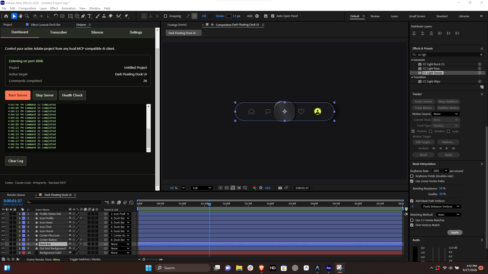
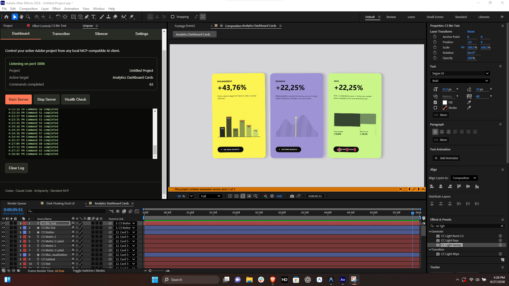

# Uniprae

> **Direct MCP & AI Bridge for Adobe Premiere Pro and After Effects**  
> Developed by **[@Gulubba_](https://github.com/Gulubba)**

Uniprae connects your AI coding assistants and automation workflows (Antigravity, Claude Code, Codex, Cursor, Windsurf, or custom scripts) straight into Adobe Premiere Pro and Adobe After Effects. It gives your AI direct visibility into your active timeline, project bins, and composition trees, while letting it create sequences, manipulate layers, set keyframes, build motion graphics, remove dead silence, and auto-transcribe audio with Groq Whisper.

---

## What It Does

- **Adobe Premiere Pro Bridge**: Inspect active sequences and clip tracks, cut and ripple-delete silence, auto-transcribe using Whisper, place media, adjust speed, and mute tracks.
- **Adobe After Effects Bridge**: Generate comps, manipulate shape and text layers, set precise easing curves and spring physics, parent layers, apply effects and expressions, and capture high-res frame previews.
- **Groq AI Audio Transcriber**: Lightning-fast speech-to-text directly in Premiere using Groq's cloud-accelerated Whisper models.
- **Video Silencer**: Automatically detects dead air in your timeline footage and cuts it cleanly without manual scrubbing.

---

## Step-by-Step Setup Guide

Getting Uniprae up and running takes about 3 minutes. Follow these simple steps:

### 1. Requirements

Before starting, make sure you have:
- **Adobe Premiere Pro** (2022 or later) and/or **Adobe After Effects** (2022 or later)
- **Node.js 20+** installed on your system ([Download Node.js](https://nodejs.org/))
- **Python 3.10+** (if you plan to run local silence removal and audio processing scripts)

---

### 2. Install the Adobe Extensions

We have included a setup script that enables unsigned CEP extensions and links the panels directly to your Adobe extensions folder:

1. Right-click `Install-Uniprae.bat` (or run it in PowerShell/Terminal) as Administrator.
2. The installer will:
   - Enable CEP `PlayerDebugMode` in Windows Registry so Adobe apps load the panels without signing issues.
   - Symlink or copy the extension folders to `C:\Program Files (x86)\Common Files\Adobe\CEP\extensions`.
   - Install local Node dependencies.
3. Once the installer finishes, restart Premiere Pro or After Effects.

---

### 3. Get Your Free Groq API Key

To enable fast AI transcription in the Groq Transcriber panel:

1. Head over to [Groq Console API Keys](https://console.groq.com/keys).
2. Sign in or create a free account.
3. Click **Create API Key**, copy your key, and paste it into the **Groq API Key** field in the Uniprae panel.
4. Click **Save Key**. It will stay stored securely in your panel settings.

---

### 4. Open the Panels in Adobe

1. Launch Premiere Pro or After Effects.
2. In the top application menu, go to:
   - **Window** &rarr; **Extensions** &rarr; **Uniprae**
   - **Window** &rarr; **Extensions** &rarr; **Premiere Pro MCP Bridge** (or **After Effects MCP Bridge**)
   - **Window** &rarr; **Extensions** &rarr; **Groq Transcriber**
   - **Window** &rarr; **Extensions** &rarr; **Video Silencer**
3. Verify the bridge panel displays `Bridge Connected` or shows the local websocket server status.

---

### 5. Connect Your AI Assistant (Antigravity / Claude / Codex)

Uniprae runs a lightweight local bridge server that speaks the Model Context Protocol (MCP).

#### If using Antigravity IDE:
Add Uniprae to your workspace MCP configuration (`mcp_config.json`):
```json
{
  "mcpServers": {
    "uniprae": {
      "command": "node",
      "args": ["C:/Program Files (x86)/Common Files/Adobe/CEP/extensions/premiere_mcp_bridge/mcp-server/index.js"]
    }
  }
}
```

#### If using Claude Code / Claude Desktop:
Add the server entry to your `claude_desktop_config.json`:
```json
{
  "mcpServers": {
    "uniprae": {
      "command": "node",
      "args": ["C:/path/to/Uniprae/extensions/premiere_mcp_bridge/mcp-server/index.js"]
    }
  }
}
```

---


---

## Extension Previews

<div align="center">
  
  
</div>


## Panel Features

### Premiere Pro & After Effects Bridge
- Real-time two-way communication between the Adobe ExtendScript engine and MCP clients.
- Timeline inspector: Read clip start/end points, track indices, markers, and audio state.
- Automated generation of complex kinetic typography and motion presets in AE.

### Groq Whisper Transcriber
- Uses `whisper-large-v3-turbo` for near-instant speech recognition.
- Direct timeline subtitle track and caption creation.
- Custom vocabulary / prompt support for brand names and slang.

### Video Silencer
- dB threshold and min-duration silence detection.
- Non-destructive cuts directly on your active sequence.

---

## Project Structure

```
Uniprae/
  ├── extensions/
  │   ├── premiere_mcp_bridge/       # CEP panel & MCP server for Premiere Pro
  │   ├── aftereffects_mcp_bridge/   # CEP panel & MCP server for After Effects
  │   ├── groq-transcriber/          # Fast Whisper transcription panel
  │   └── video_silencer/            # Timeline silence cutter panel
  ├── scripts/                       # ExtendScript and automation helpers
  ├── Install-Uniprae.bat            # Automated 1-click Windows installer
  └── README.md                      # Documentation & Guide
```

---

## Author & Credits

Created and maintained by **[@Gulubba_](https://github.com/Gulubba)**.  
Feedback, bug reports, and contributions are welcome via GitHub issues and pull requests!

---

## License

MIT License. See `LICENSE` for details.
